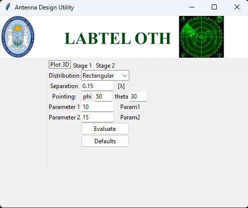
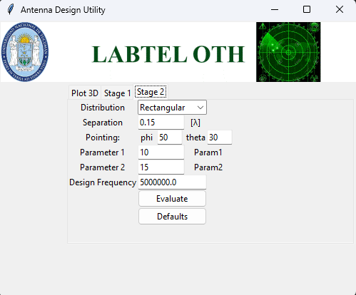
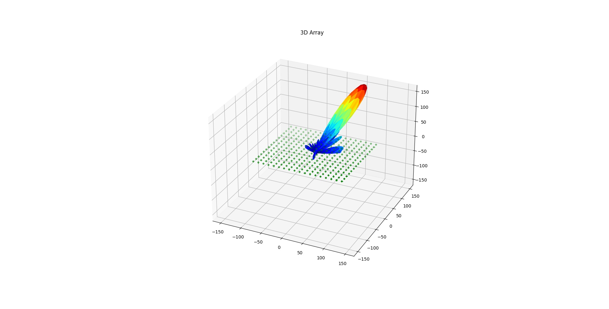
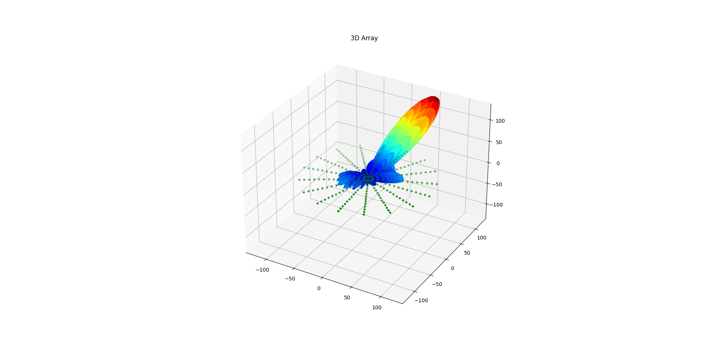
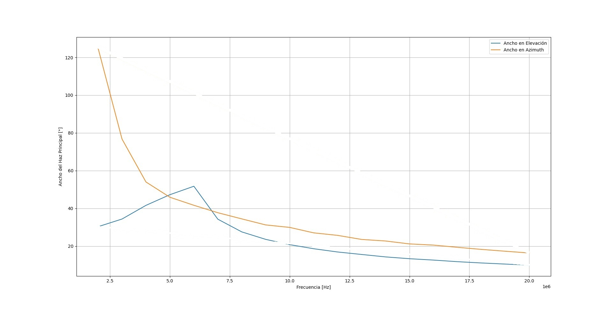
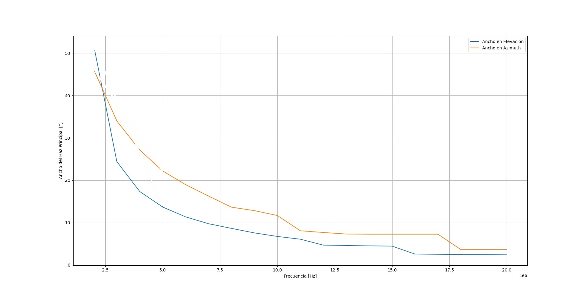
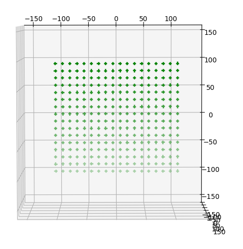
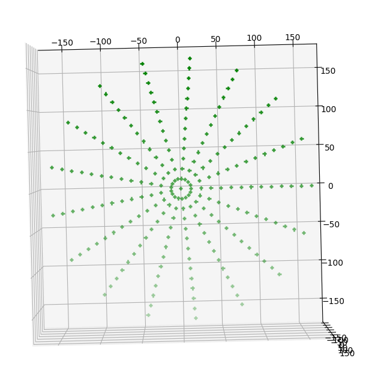

## Introducción

Este software es una herramienta para asistir en el diseño de Arreglos de Antenas. 
Está orientado a exponer lo aprendido y a respaldar el informe final entregado en el curso de posgrado: "*Diseño Avanzado de Arreglos de Antenas*", impartido por el Dr. Ing. Fernando Alberto Miranda Bonomi, en la Universidad Nacional de Tucumán, según *res. HCD 0165/2021*. 

El informe presentado se encuentra en la carpeta `/Informe`

Además, partes de esta herramienta serán reutilizadas para la construcción de un simulador de Radares OTH, enmarcado en el proyecto PIDDEF 03/2020.

## Preview

La interfaz de usuario permite mostrar (Plot3d) y evaluar arreglos en dos etapas (Stage 1 y Stage 2).

|  |  |  |
|:---:|:---:|:---:|
| Interfaz de usuario - Plot | Interfaz de usuario - Etapa 1 | Interfaz de usuario - Etapa 2 |

|  |  |
|:---:|:---:|
| Patrón 3D de arreglo rectangular 18 x 16 | Patrón 3D de arreglo rectangular 13 x 17 |

|  |  |
|:---:|:---:|
| Respuesta en frecuencia de arreglo rectangular 18 x 16 | Respuesta en frecuencia de arreglo rectangular 13 x 17 |

<!-- |  |  |
|:---:|:---:|
| Plot de arreglo rectangular 18 x 16 | Plot de arreglo rectangular 13 x 17 | -->

## Pre-requisitos

Este proyecto depende de un paquete alojado en un repositorio privado, `arreglo_antenas_core`. Para instalar este paquete, necesitarás obtener acceso al repositorio privado. 

Cuando tengas acceso, podras usar tu usuario para la instalación.

## Instalación

1. Abrir una terminal en el directorio deseado y clonar este repositorio:
   ```
   git clone https://github.com/allanes/antenna-array-design-tool.git
   ```

2. Crear un nuevo ambiente virtual. Se muestran las instrucciones para Windows:
    ```   
    cd pothole-detector-gui
    python -m venv .venv
    .venv\Scripts\activate
    python -m pip install -U pip
    ``` 

3. Instalar los requerimientos en el nuevo ambiente:
    ```
    pip install -r requirements.txt    
    pip install git+https://tu-usuario-bitbucket@bitbucket.org/radaresfacet/arreglo_antenas_core.git
    ```

## Instrucciones de uso

Iniciar la aplicación:
    ```
    python utilities.py
    ```

El software presente en este repositorio está separado en 3 partes:

***Plot3d***: Pestaña que permite configurar un arreglo de prueba y muestra su:
-   Distribución espacial,
-   Patrón de radiación,
-   Ancho de haz de azimuth y
-   Ancho de haz de elevación

***Etapa 1***: Evalúa el ancho de haz de azimuth y elevación para un conjunto arbitrario de arreglos de antenas. Los datos se loguean en la carpeta `/logs/`.Esto permite analizar el comportamiento de un arreglo en función de los parámetros que se pueden variar:
-   Distribución,
-   Serparación,
-   Apuntamiento (elevación, azimuth),
-   Número de elementos en un eje
-   Número de elementos en el otro eje

***Etapa 2***: Permite ingresar los datos del arreglo seleccionado en la etapa anterior, luego de analizar los resultados. Acá se debe elegir la frecuencia de diseño, con la cual desnormalizarlo. La salida es su respuesta en frecuencia y también queda logueada en la carpeta `/logs`.

## Overview
El archivo de Jupyter Notebook Patron_arreglo_v3 fue tomado de las clases y representa el core del funcionamiento.

Para la simulación completa, se requieren 2 etapas:

-   Etapa 1: Calcula el ancho del haz principal en elevación y azimuth. El ancho se evalúa para un conjunto de arreglos con un apuntamiento dado, variando la cantidad de elementos
en 2 ejes. Para arreglos rectangulares, los ejes corresponden con los ejes cartesianos.
Para otros arreglos, la forma esta dada por la función que genera la distribucion. Está pensada para ser usada con la frecuencia normalizada. La visualización de estos datos es de utilidad para elegir arreglo a desnormalizar en la Etapa 2.

-   Etapa 2. Calcula el ancho del haz en función de la frecuencia. Trabaja sobre el arreglo elegido en la Etapa 1 y lo desnormaliza en frecuencia, de forma que esta etapa evalúa la respuesta en frecuencia de un arreglo completamente parametrizado.


